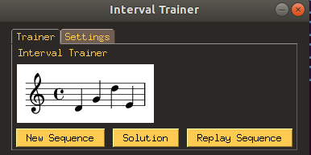
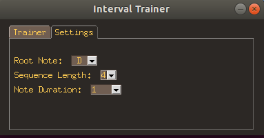

# IntervalTrainer

Interval training application. User hears a sequence of notes that follows a specified major scale. 

pysimplegui + music21

Next major TODOs:
- accept midi input for live training
- generate training session for offline use

---

Version 1:

User can select major scale, sequence length, and duration of each note. 

